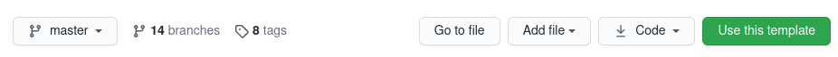
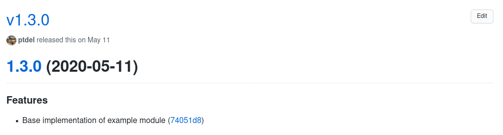
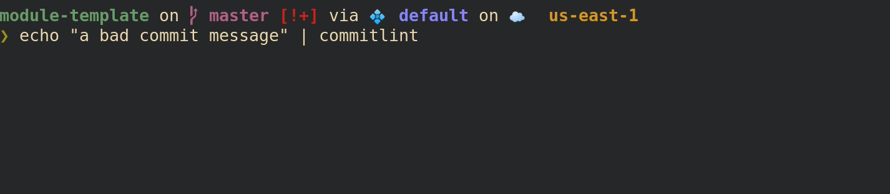
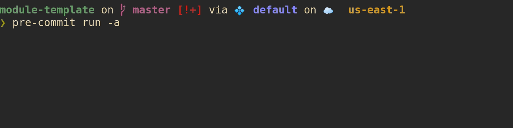

Terraform Module Template
=========================
This repository provides a template for creating new Terraform modules.
It's intended to demonstrate how one might go about standardizing their
modules and subjecting them to integration tests in CI.

Table of Contents
-----------------
- [Terraform Module Template](#terraform-module-template)
  - [Table of Contents](#table-of-contents)
  - [Dependencies](#dependencies)
  - [Initial Setup](#initial-setup)
  - [Using this Template](#using-this-template)
    - [Assumptions](#assumptions)
    - [Creating a Module from this Template](#creating-a-module-from-this-template)
    - [Components of the Module Template](#components-of-the-module-template)
    - [Default Template Behaviors](#default-template-behaviors)
  - [Local Testing](#local-testing)
    - [Testing Modules with dependencies](#testing-modules-with-dependencies)
    - [Testing Root Modules](#testing-root-modules)
  - [Contributing](#contributing)
  - [Versioning](#versioning)
  - [Contributors](#contributors)

Dependencies
------------
It is assumed that you have several tools already installed:
* [terraform][1]
* [go][2]
* [terraform-docs][9]
* [pre-commit][3]
* [commitlint][4]

Initial Setup
-------------
After you have cloned your newly created module from this template, be sure to
run the following before making any changes.
```bash
$ pre-commit install --install-hooks
$ pre-commit install --hook-type commit-msg
```
[pre-commit][3] is a gatekeeper that ensures anything we push up to GitHub has
gone through a number of checks beforehand.  This keeps our codebase clean.
We'll get into [pre-commit][3] more in the next section.

Using this Template
-------------------

### Assumptions
While writing this, I'm making some opinionated assumptions about how
terraform modules ought to be structured.  It's expected that modules derived
from this template will be treated as building blocks that will be utilized
with one another inside of a root module.  I would recommend reading over the
official [documentation][20] regarding how to organize modules.  As an aside
you should always strive to keep your modules declarative and separated from
high-falutin logic but that's me.  Take it or leave it.
### Creating a Module from this Template
To get started using this template, simply click the "Use this template" button
at the top of the repository, in the location where the clone url normally sits.

### Components of the Module Template
This template attempts to provide sane defaults for a number of tools to allow
anybody using it to focus on writing their module.  Most of the files can be
ignored but we'll quickly go over a few of them and what behaviors they have.

* `.releaserc`
Tells [semantic-release][6] how to behave when creating a versioned release of
a module. [semantic-release][6] will, among other things, create a CHANGELOG
based on commit messages, and include artifacts with our release on the
releases page of the repository.  It will create a git tag with a corresponding
semantic release number for each release.
* `Makefile`
[semantic-release][6] executes this file in order to create artifacts to be
included in a release on the release page of the module repository.
* `.commitlintrc.js`
Defines our [conventional commit][4] format behavior.  It is highly recommended
that you read over what [conventional commit][4] is.  In a nutshell: it ensures
that commit messages are formatted in such a way that the CHANGELOG and other
things can be generated from them automatically.  For example, with the
following commit message:
```
feat: Base implementation of example module
```
We see the following line generated in the CHANGELOG for our versioned release
of the module on it's releases page.



You can check if a message is properly formatted by piping it into `commitlint`:


* `.pre-commit-config.yaml`
Specifies "checks" to run on our code at certain stages.  When you ran the
commands from the [initial setup](#initial-setup) phase, you told `pre-commit`
to run when we make a *push* or *commit* to a repository. The purpose of
`pre-commit` is to "get in the way" of making mistakes--so it takes some
getting used to.  You can run `pre-commit` at any time with the following
command to check your current state:
```bash
$ pre-commit run -a
```
If all is well, it should look like this:

It's important to remember that `pre-commit` will check what has been staged
with `git add`.  If any changes to files happen, you must re-stage them for
committal with a subsequent `git add`.

* `.github/workflows`
  * `build_and_test.yml`
  This workflow builds and tests your Terraform code in a dedicated testing
  account.  This workflow will:
    * validate syntax
    * format syntax
    * check provider logic
    * run terratest against your module.
  * `release.yml`
  This workflow runs last, and will create a versioned release of your module,
  assuming that it builds and tests properly.
  * `release_dry_run.yml`
  This optional workflow is for checking that a proper release can be made
  before attempting to merge with the master branch.  To use this workflow
  create a pull request against the `release` branch.

There are some other random workflows provided as examples of enforcing
certain rules on modules.

### Default Template Behaviors
This template also utilizes multiple [GitHub Applications][10] to provide
extended functionality on a module repository.  Specifically, the following
applications are used:
* [Welcome][13]
* [delete-merged-branch][14]
* [create-issue-branch][15]
* [prevent-public-repos][16]
* [semantic-pull-requests][17]
* [stale][18]

For more information on configuring GitHub applications, please consult the
[documentation][11].

**NOTE** you can store extension configurations in another repository and
override their values as needed in a module repository.  It's out of scope for
this documentation so I'm not going to demonstrate it.

Local Testing
-------------
We're utilizing [Terratest][21] to make assertions about our Terraform modules.
The tests are written in [Go][22], but you don't need to be a seasoned gopher
to write meaningful tests and understand them.  The template includes some
boilerplate for writing tests, but I won't be going into too much detail about
how to write tests in this readme.  Suffice to say you build a module, and then
make assertions about it's properties and outputs to ensure it came out how you
expected it to.

You should be able to run tests simply by typing
```bash
$ go test ./test
```
Be aware that some modules may require more time to fully test. You can extend
the default timeout by adding `-timeout 30m` to the test command.

### Testing Modules with dependencies

Sometimes a module that you want to test has dependencies on other modules,
or other data sources that might need to exist beforehand.  For example, if
you're writing a module that takes in an s3 bucket as a data source.  In a root
module this isn't a problem because all of our dependencies are resolved by the
`terraform plan` step.  To make sure that each module we pull into a root
module is a reliable building block, we need a way to test them all
individually.  This is where [localstack][19] comes in.  I'm not going to go
into detail about all the things [localstack][19] can do as you should go read
the documentation yourself but in essence, it provides us with a mocked AWS
environment.  Below is an example GitHub workflow using [localstack][19] to
test a hypothetical SNS module that depends on an existing bucket:
```yaml
test:
    name: Unit Test Terraform Module
    runs-on: ubuntu-latest
    services:
      localstack:
        image: localstack/localstack:latest
        env:
          SERVICES: s3, sns
          DEFAULT_REGION: us-east-1
          AWS_ACCESS_KEY_ID: localkey
          AWS_SECRET_ACCESS_KEY: localsecret
        ports:
          - 4566:4566
    steps:
    - uses: actions/checkout@v2
    - uses: actions/setup-python@v2
      with:
        python-version: 3.9
    - name: Build Mock Aws Resources
      run: |
        pip install awscli
        aws s3api create-bucket                \
          --region us-east-1                   \
          --endpoint-url http://localhost:4566 \
          --bucket test-msg-lambda-bucket

    ...[testing steps]...
```
We're taking advantage of the fact that GitHub actions can be run with
'services' which are basically sidecar containers available during the lifetime
of a workflow. By mocking out an s3 bucket, we can build our SNS module that
takes it as a data source.

We tell terraform to use localstack by passing it provider info.  In this case,
it's in a local.tf file.
```hcl
provider "aws" {
  region                      = "us-east-1"
  access_key                  = "localkey"
  secret_key                  = "localsecret"
  skip_credentials_validation = true
  skip_metadata_api_check     = true
  skip_requesting_account_id  = true
  skip_region_validation      = true
  insecure                    = true
  s3_force_path_style         = true

  endpoints {
    s3         = "http://localhost:4566"
    sns        = "http://localhost:4566"
  }
}
```
chances are that we don't want to subject this information itself to any tests,
so in our testing step we comment out our local.tf before testing so it's
ignored by terra-test:
```yaml
    - name: Run Tests Against Terraform Module
      run: |
        echo "commenting out nested provider blocks for testing"
        find ./*/local.tf -type f -exec sed -i -e 's/^/#/' {} +
        go test -v ./test -timeout 30m
```
I'll admit that's a bit of a hack--if you have a better idea make a
Pull Request!

Now I know what you're thinking.  "If I'm building my modules in a totally
mocked environment, can I really be sure they'll work in a real environment?"
That's the kind of stuff that keeps developers up at night.  Best not to think
about it too much.

### Testing Root Modules

So you've got a bunch of tested modules built and now you're ready to test them
all together.  How you do it is up to you but I'll offer an approach that has
worked well enough for me that doesn't take too much effort.

In my root module, I refer to all of the individual modules I want to bring
together as submodules.  Ugh, I know.
```ini
[submodule "sns-topic"]
	path = sns-topic
	url = git@github.com:MyAwsTerraform/sns-topic
	branch = v1.0.0
[submodule "sqs-queue"]
	path = sqs-queue
	url = git@github.com:MyAwsTerraform/sqs-queue
	branch = v1.1.1
[submodule "lambda"]
	path = lambda
	url = git@github.com:MyAwsTerraform/lambda
	branch = v1.1.0
```
You can refer to submodules in GitHub by version tags, or you could use commit
hashes--it's up to you.  The benefit of having our terraform modules as git
submodules is that we know which versions of each we are building together.

Building our root module in CI is also easy and requires just one extra step:
```yaml
...
    steps:
    - uses: actions/checkout@v2
      with:
        submodules: recursive
        token: ${{ secrets.CICD_REPOSITORY_CHECKOUT }}
...
```
Note that you'll need to have a developer token with access to the other
module repositories for the checkout action to work properly.

This approach lets you build your root modules in the same way that you
would build stand-alone modules from this template.  You have the options to
build it all in a real environment or with [localstack][19].


Contributing
------------
 1. **Fork** the repository
 2. **Clone** the project from your forked repository to your macine
 3. **Commit** changes to your own branch
 4. **Push** your changes on your branch to your forked repository.
 5. Submit a **Pull request** back to our repository for review.

**NOTE**: always merge from latest upstream before submitting pull requests.

Versioning
----------
[Semantic Versioning][7] will be used to version this project.
Please consult the [releases][8]
page for a complete list of available versions.

Contributors
------------
* [Patrick Delaney](https://github.com/ptdel)


[1]: https://www.terraform.io/downloads.html
[2]: https://golang.org/dl/
[3]: https://pre-commit.com/#install
[4]: https://github.com/conventional-changelog/commitlint#getting-started
[5]: https://www.conventionalcommits.org/en/v1.0.0/#summary
[6]: https://github.com/semantic-release/semantic-release
[7]: https://www.semver.org/
[8]: https://github.com/ptdel/tested-terraform/releases
[9]: https://github.com/segmentio/terraform-docs
[10]: https://github.com/marketplace
[11]: https://probot.github.io/docs/best-practices#store-configuration-in-the-repository
[12]: https://github.com/ptdel/ExtensionConfiguration
[13]: https://probot.github.io/apps/welcome/
[14]: https://github.com/SvanBoxel/delete-merged-branch
[15]: https://github.com/robvanderleek/create-issue-branch
[16]: https://github.com/issc29/probot-prevent-public-repos
[17]: https://github.com/zeke/semantic-pull-requests
[18]: https://github.com/probot/stale
[19]: https://github.com/localstack/localstack
[20]: https://www.terraform.io/docs/language/modules/index.html
[21]: https://terratest.gruntwork.io/docs/getting-started/quick-start/
[22]: https://go.dev/blog/gopher